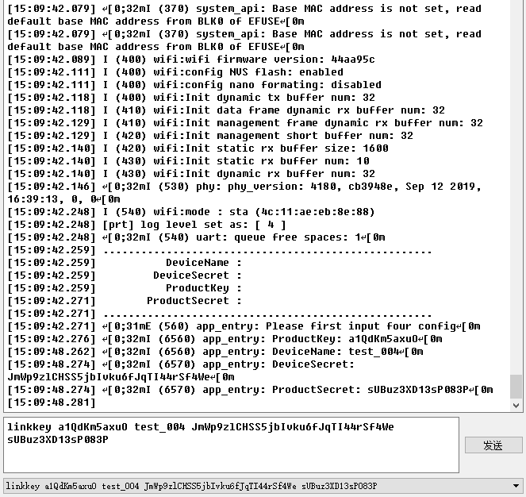
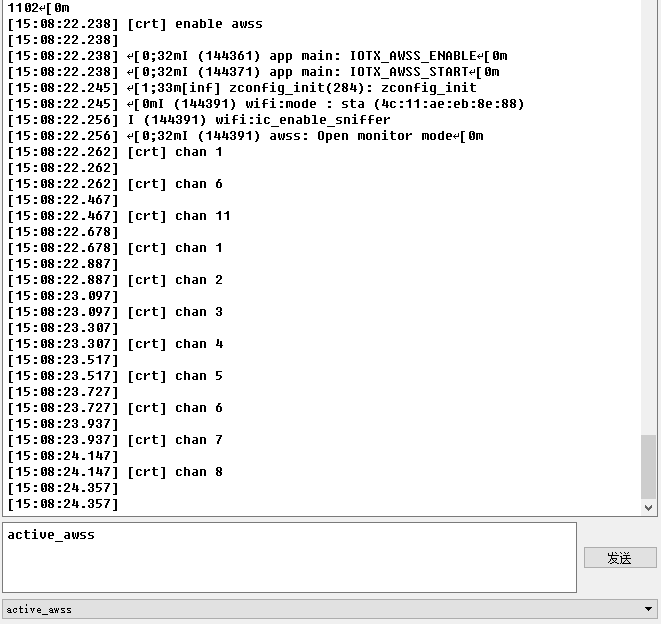
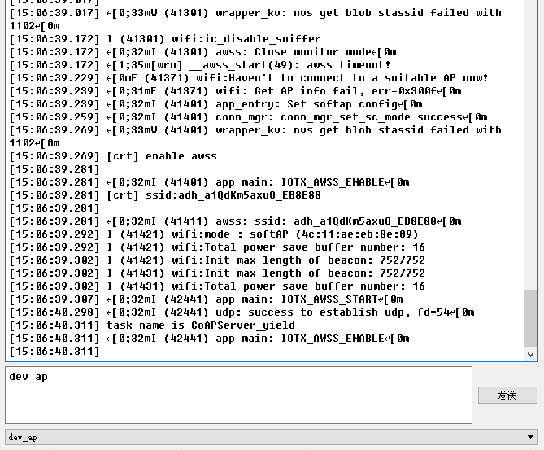

# solo 解决方案

### 介绍
`example_solo` 为客户提供串口命令用于配置模组配网模式，三元组设置，reset 解绑和直接连接 WIFI SSID, 用户可以更便捷的接入阿里云生活物联网平台 & 天猫精灵 IoT 开放平台。

### 解决方案部署
#### 1.参考 [README](../../../README.md) 文档进行硬件准备、环境搭建、SDK 准备

#### 2.阿里云生活物联网平台部署
在阿里云 [物联网平台](https://iot.console.aliyun.com) 创建产品或者在阿里云 [生活物联网平台](https://living.aliyun.com/#/) 创建产品，会显示在 `物联网平台`，参考[创建产品文档](https://living.aliyun.com/doc#readygo.html).
> 如果已经创建过产品，可跳过此步骤。 
> 创建产品设备后，可以获取`三元组`，后续可通过命令设置进模组里。

#### 3.串口命令介绍

配置四元组: linkkey ProductKey DeviceName DeviceSecret ProductSecret   
设备热点配网: dev_ap  
一键配网: active_awss  
重启解除绑定: reset  
直接连网: netmgr connect ssid password  
注意: 每个配置参数之间以一个空格间隔，顺序不能有错。

#### 4.下载本工程并且编译烧录进模组

#### 5.设备运行

设备第一次上电后，需先配置四元组。

开启一键配网: active_awss, 注意一键配网只有60s时间，超时需要重新下发一键配网。

开启设备热点配网: dev_ap, 注意设备热点配网只有60s时间，超时需要重新下发设备热点配网。

设备热点配网和设备热点配网可以自由切换。

设备端收到 SSID 和 Password 后连接到阿里云生活物联网平台。
